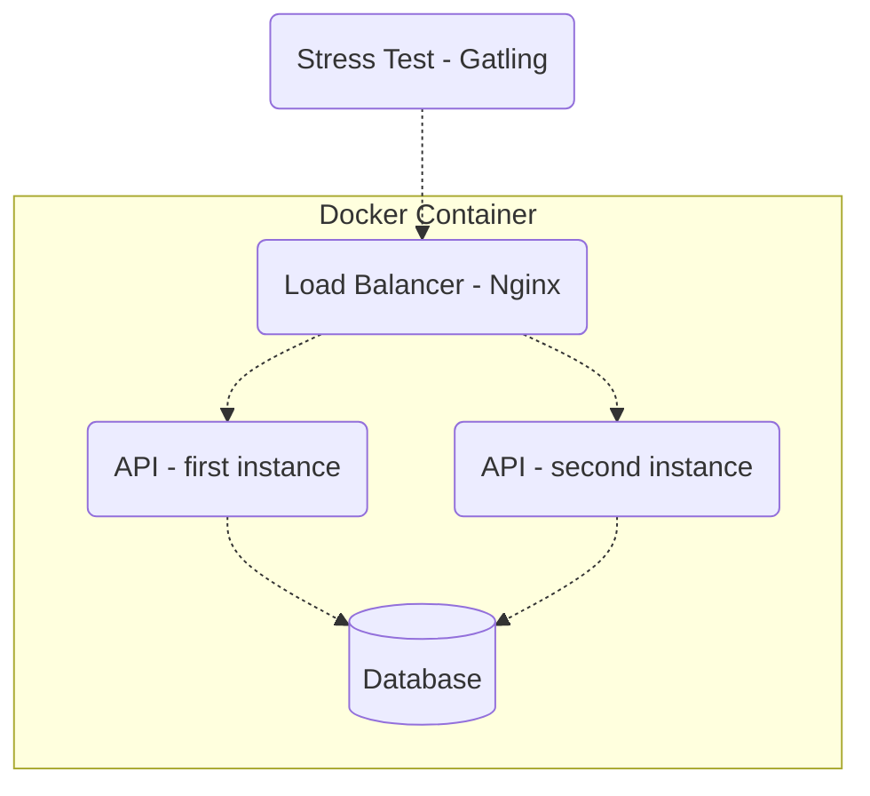

# Description

This application is my try at a backend challenge (post link). The challenge consisted of building a system as performant as possible. This system will be testing using gatling to run stress-tests.
This application uses docker-compose with 2 instances of the web-server (using nginx) and a postgres database. The big challenge here was to manage the available resources (1.5 vCPU and 3GB of memory).

# Architecture

# Endpoints

- `POST` /pessoas – endpoint to create a person.
- `GET` /pessoas/[:id] – endpoint to get a single person by id.
- `GET` /pessoas?t=[:search term] – endpoint to search for people using a search term.
- `GET` /contagem-pessoas – endpoint that returns the number of people in the database.

# Used technologies

- Go - programming language
- Fiber - http server framework
- Postgres - database
- Go-jet - sql builder
- Docker - containerize all services
- Nginx - load balancer

# Run application (server + db)

1. `make docker-build`
2. `make docker-up`
